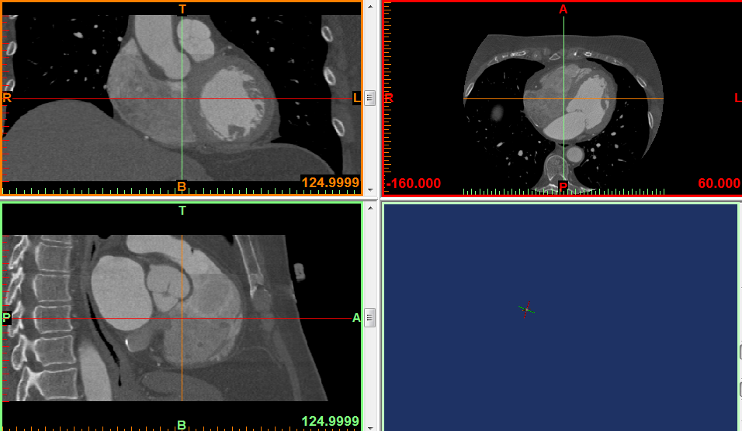
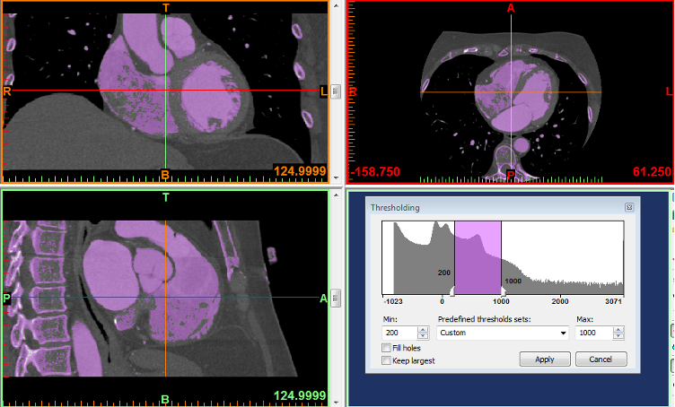
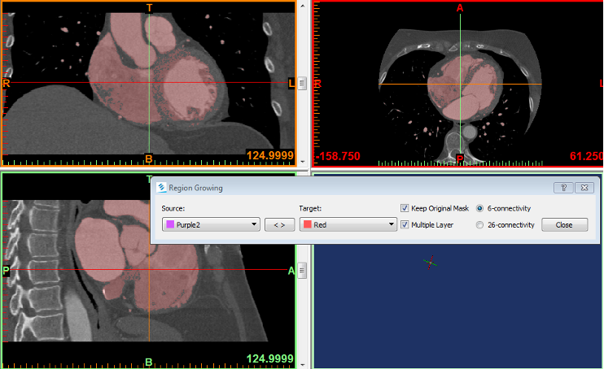
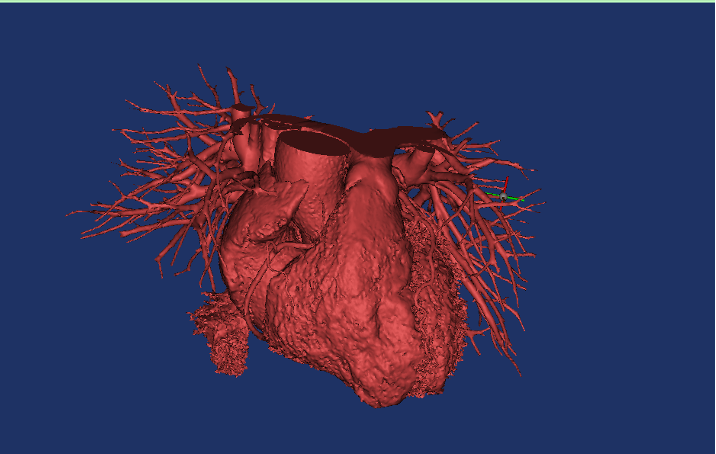
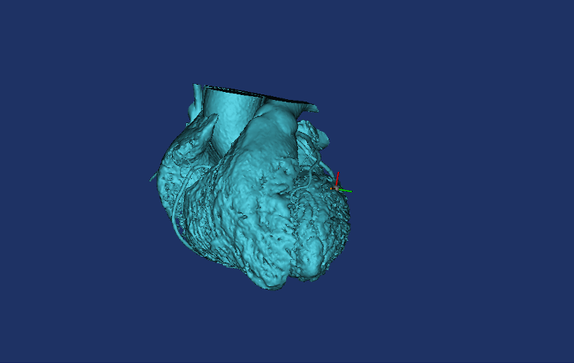

# 3D Heart Segmentation and Reconstruction from CT Scans

## Overview

This project focuses on the reconstruction of a 3D human heart model from computed tomography (CT) scan data using medical imaging software.

The workflow includes:
- heart isolation from surrounding anatomical structures,
- segmentation of cardiac chambers and vessels,
- 3D reconstruction,
- mesh optimization and smoothing,
- creation of a hollow heart model for internal visualization.

The project was completed using medical image segmentation and mesh-processing techniques in Mimics Medical and 3-matic Medical.

---

# Objectives

The main objective of the project was to create an accurate 3D model of the human heart from CT images and separate its major anatomical structures.

Project scope:
- segmentation of the heart from surrounding tissues and vessels,
- generation of a 3D heart model,
- separation of ventricles, atria, and aortic structures,
- creation of a hollow internal structure,
- remeshing and mesh optimization.

---

# Software Used

- Mimics Medical 19
- 3-matic Medical 11

---

# Workflow

## 1. Importing CT Data

The first step consisted of loading CT scan data into Mimics Medical.

---

## 2. Thresholding

Thresholding was used to isolate the desired grayscale range corresponding to cardiac tissue.

Parameters:
- Hounsfield range: 200–1000 HU
- Material preset: Standard

This operation generated the initial segmentation mask.

---

## 3. Region Growing

The `Region Growing` tool was used to isolate the heart from surrounding anatomical structures such as the spine and neighboring tissues.

---

## 4. Initial 3D Reconstruction

After segmentation, the first 3D heart model was generated.

---

## 5. Vessel Removal

Unwanted blood vessels and surrounding structures were removed using the `Edit Mask` tool.

---

## 6. Chamber Separation

Using:
- Multiple Slice Edit
- Interpolate
- Split Mask

the heart was separated into:
- right ventricle,
- right atrium,
- left ventricle,
- left atrium,
- aortic structures.

### Right Ventricle Segmentation

### Right Atrium Segmentation

### Left Ventricle Segmentation

### Left Atrium Segmentation

---

## 7. Final Segmented Heart Assembly

All segmented structures were combined into a complete anatomical heart model.

---

# Mesh Processing and Optimization

The segmented model was transferred to 3-matic Medical for mesh refinement and optimization.

---

## 8. Smooth Operation

The `Smooth` function was applied to reduce surface irregularities and improve geometry quality.

### Before Smoothing

### After Smoothing

---

## 9. Wrap Operation

The `Wrap` function generated a cleaner outer surface and improved edge continuity.

### Before Wrap

### After Wrap

---

## 10. Local Smoothing

Local smoothing was used to manually refine selected regions of the mesh.

---

# Hollow Heart Model

The `Hollow` operation was used to create an empty internal structure simulating blood flow space inside the heart.

---

# Cross-Section Visualization

The `Trim` function was used to cut the model and expose internal anatomical structures.

---

# Final Result

The final model:
- contains separated anatomical structures,
- includes hollow internal chambers,
- has optimized mesh topology,
- can be used for visualization and educational purposes.

---

# Challenges

Main challenges encountered during the project:
- separating soft tissues with unclear boundaries,
- isolating myocardium from surrounding structures,
- preserving anatomical consistency during segmentation,
- optimizing mesh quality while maintaining geometry accuracy.

---

# Educational Purpose

This project was created for educational and research purposes only.

All medical data used in this project was anonymized.

The generated model should be considered an approximation and not a clinically validated medical model.

---

# Skills Demonstrated

- Medical image segmentation
- CT image processing
- 3D reconstruction
- Biomedical visualization
- Mesh optimization
- CAD/CAE preprocessing
- Anatomical modeling
- Surface remeshing

---

# Author

[Your Name]

Biomedical Engineering / 3D Medical Modeling / Medical Imaging
